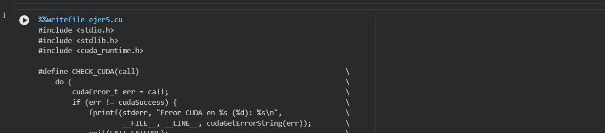

## Create and execute a CUDA project

### Default import for every CUDA project

```
#include <stdio.h>
#include <stdlib.h>
#include <limits.h>
#include <cuda_runtime.h>
#define CHECK_CUDA(call)                                                     \
    do {                                                                     \
        cudaError_t err = call;                                              \
        if (err != cudaSuccess) {                                            \
            fprintf(stderr, "Error CUDA en %s (%d): %s\n",                   \
                    _FILE, __LINE_, cudaGetErrorString(err));            \
            exit(EXIT_FAILURE);                                              \
        }                                                                    \
    } while (0)
```

### How to execute a CUDA project

You have to go to the next url (Important): If your country is blocked you have to use vpn

```
https://colab.research.google.com/#scrollTo=DfhueKZ4OOdM
```

Here you push in create a new notebook.
When load you push in add file and them you add one file of this project with format .ipynb
and after you jast need update the code in this part:



### Download file the compiler

For that you need create a new cell and here add this command:

```bash
from google.colab import files
files.download('ejer5.cu')
```
### (Optional) You can download the file with not any extension
I think that is not important but if you want download this too. Just
put the same command of the compiler but in this case omitted the .cu
```bash
from google.colab import files
files.download('ejer5')
```